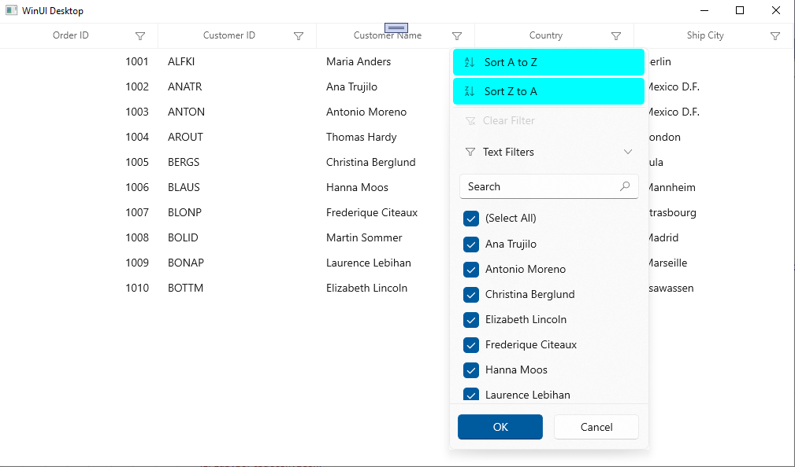

# How to customize the filter popup in WINUI DataGrid(SfDataGrid)

In [WinUI DataGrid](https://www.syncfusion.com/winui-controls/datagrid) (SfDataGrid), You can customize the appearance of filter popup by overriding the style of [GridFilterControl](https://help.syncfusion.com/cr/winui/Syncfusion.UI.Xaml.DataGrid.GridFilterControl.html). In this article, we customized the background of the sort button for your reference.
 
 ```xml
<Style x:Key="GridFilterControlStyle" TargetType="dataGrid:GridFilterControl">
    <Setter Property="Template">
        <Setter.Value>
            <ControlTemplate TargetType="dataGrid:GridFilterControl">
                 .............
                 .............
                 <StackPanel>
                     <grids:SortButton x:Name="PART_SortAscendingButton"
                                       Height="34"
                                       Width="246"
                                       Margin="4,1,4,3"
                                       Background="Aqua"
                                       Padding="{ThemeResource SyncfusionItemPadding}"
                                       Content="{TemplateBinding AscendingSortString}"
                                       Style="{StaticResource SortButtonStyle}"
                                       Visibility="{TemplateBinding SortOptionVisibility}">
                         <grids:SortButton.Icon>
                             <Grid >
                                 <Path Width="12"
                                       Height="12"
                                       HorizontalAlignment="Left"
                                       VerticalAlignment="Center"                                    
                                       Data="M0.38801098,9.000021 L5.5220246,9.000021 5.5220246,9.5080204 1.7080145,15.019021 5.4740243,15.019021 5.4740243,16.000021 0.093009949,16.000021 0.093009949,15.46802 3.9210205,9.9870205 0.38801098,9.9870205 z M3.2180066,1.0400046 C3.1900063,1.2250037 3.1560063,1.3720028 3.1220064,1.4790025 L2.1640043,4.2719874 4.2960086,4.2719874 3.3290067,1.4790025 C3.3000064,1.3870028 3.2700067,1.2410036 3.2380066,1.0400046 z M2.6070051,1.0252013E-05 L3.9080076,1.0252013E-05 6.4940124,7.0009727 5.2280102,7.0009727 4.6010089,5.2189822 1.8630037,5.2189822 1.2610025,7.0009727 0,7.0009727 z M10.499012,0 L11.499012,0 11.499012,14.135806 13.789003,11.945988 14.484,12.666985 11.000013,15.999971 7.5150249,12.666985 8.2100222,11.945988 10.499012,14.134064 z"
                                       Fill="{ThemeResource SyncfusionDataGridFilterControlSortIcon}"
                                       Stretch="Fill" />
                             </Grid>
                         </grids:SortButton.Icon>
                     </grids:SortButton>
                     <grids:SortButton x:Name="PART_SortDescendingButton"
                                       Height="34"
                                       Width="246"
                                       Margin="4,0,4,3"
                                       Background="Aqua"
                                       Padding="{ThemeResource SyncfusionItemPadding}"
                                       Content="{TemplateBinding DescendingSortString}"
                                       Style="{StaticResource SortButtonStyle}"
                                       Visibility="{TemplateBinding SortOptionVisibility}">
                         <grids:SortButton.Icon>
                             <Grid >
                                 <Path Width="12"
                                       Height="12"
                                       HorizontalAlignment="Left"
                                       VerticalAlignment="Center"
                                       Data="M3.2180057,10.040006 C3.1900058,10.225006 3.1560054,10.372005 3.1220055,10.479004 L2.1640038,13.271989 4.2960076,13.271989 3.3290057,10.479004 C3.3000059,10.387005 3.2700057,10.241005 3.2380056,10.040006 z M2.6070046,9.0000122 L3.9080069,9.0000122 6.4940119,16.000975 5.2280095,16.000975 4.6010082,14.218984 1.8630033,14.218984 1.2610021,16.000975 0,16.000975 z M0.38801003,2.2888184E-05 L5.5220239,2.2888184E-05 5.5220239,0.50802231 1.7080135,6.0190225 5.4740238,6.0190225 5.4740238,7.0000224 0.093009472,7.0000224 0.093009472,6.4680223 3.9210196,0.9870224 0.38801003,0.9870224 z M10.499024,0 L11.499024,0 11.499024,14.137797 13.789006,11.947995 14.48401,12.669 11.000014,16.001995 7.5150103,12.669 8.2100148,11.947995 10.499024,14.136076 z"
                                       Fill="{ThemeResource SyncfusionDataGridFilterControlSortIcon}"
                                       Stretch="Fill" />
                             </Grid>
                         </grids:SortButton.Icon>
                     </grids:SortButton>
                   </StackPanel>
                   ..............
                   ..............
            </ControlTemplate>
        </Setter.Value>
    </Setter>
</Style> 
 ```


Take a moment to peruse the [WINUI DataGrid - Filtering](https://help.syncfusion.com/winui/datagrid/filtering?_gl=1*12qmxiy*_ga*MjEyNzA1Mjg5Ni4xNzUzODczNDk3*_ga_41J4HFMX1J*czE3NTQzNjc0MTEkbzQkZzEkdDE3NTQzNjgwODYkajYwJGwwJGgw) documentation, where you can find about the filtering with code examples.
